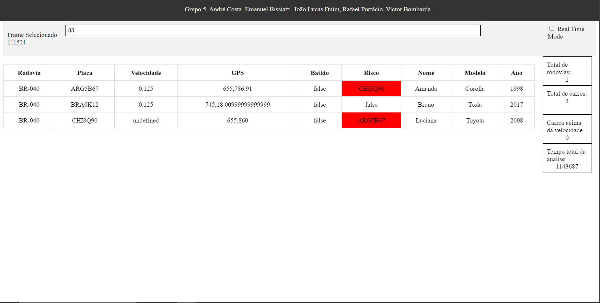

# Sistema de monitoramento de rodovias, etl, simulação e dashboard

## André Costa, Emanuel Bissiatti, João Lucas Duim, Rafael Portácio, Victor Bombarda

## Com GRPC

Baixe o GRPC para o C++ e para o Python, compile o código C++ usando o comando: './run.sh', vá para o cmake/build. Em o comando: './route_guide_server', em seguida execute o comando em um outro terminal 'python3 server.py' para executar o cliente em python.

Obs: Rodamos essses comandos dentro da biblioteca do GRPC, em exemplos/cpp/route_guide, pois, tivemos problemas com a instalação do GRPC e sua execução em outros diretórios.

Obs2: Essa biblioteca não funcionou no Ubuntu, só conseguimos executar no Fedora 37

## O Sistema de monitoramento de rodovias

Esse software é composto de um simulador de tráfego desenvolvido em python com interface gráfica em pygame. É possível modificar os parâmetros de simulação como a quantidade de veículos, a velocidade máxima, a quantidade de faixas e a aceleração dos veículos. O simulador exporta duas informações, o log de tempo percorrido no simulador e o log de veículos que é composto de um arquivo json que informa a posição dos veículos presentes na rodovia em cada instante de tempo.  


Já o ETL foi construido para, a partir da posição dos veículos de uma rodovia em função do tempo, calcula a velocidade e a aceleração dos veículos, detecta colisões e encontra as informações relacionadas a placa do veículo a partir da simulação de uma API legada. O ETL é capaz de ler e tratar informações de múltiplas rodovias ao mesmo tempo, bem como, lidar com a chegada de novas informações de veículos em tempo real a partir de técnicas de paralelismo e multithreading. Por fim, o ETL exporta um arquivo json com as informações de velocidade, aceleração, placa e colisões dos veículos em cada instante de tempo.

E o Dashboard é uma aplicação web simples que lê o arquivo json gerado pelo ETL e exibe as informações de velocidade, aceleração, placa e colisões dos veículos em cada instante de tempo. O dashboard é atualizado a cada 5 segundos com as informações do ETL. Na interface é possível pesquisar o instante de tempo desejado e visualizar as informações dos veículos naquele instante de tempo em todas as rodovias.



## Como rodar

### Simulador de tráfego

1. python 3
2. pip
3. pygame (para visualiar a simulação, opcional)
    pip install pygame
4. numpy
    pip install numpy

Para executar o simulador, basta executar o arquivo `simulador.py` a partir da raiz do projeto com o comando:

```bash
python mock/simulador.py nome-da-rodovia
```
Observação: a rodovia precisa existir nos arquivos de configuração do simulador, para isso edite o `mock/parametros.json`.

### ETL

1. Intalar o gcc e o g++ (para compilar o código C++ do simulador)
2. Instalar o git
3. Instalar a bibloteca de json para C++:

```bash
git clone https://github.com/nlohmann/json.git
```

4. Instalar o cmake e compilar a biblioteca:

```bash
cd json
cmake .
make
sudo make install
```

Em seguida compile o código C++ do simulador e execute o arquivo `main`:

```bash
cd ..
g++ main.cpp -o main
./main
```
 
### Dashboard

1. Instalar o nodejs
2. Instalar o npm
3. Instalar as dependências do projeto:

```bash
cd dash
npm install
```

4. Iniciar o servidor:

```bash
npm start
```

5. Acessar o dashboard em `http://localhost:3000`

### Resumo da execução

1. Execute o simulador, em seguida execute o ETL e por fim o dashboard com o comando:

```bash
python mock/simulador.py BR-040 && g++ main.cpp -o main && ./main && cd dash && npm start
```
E abra o dashboard em `http://localhost:3000`, a cada 5 segundos o dashboard será atualizado com os dados do ETL. 